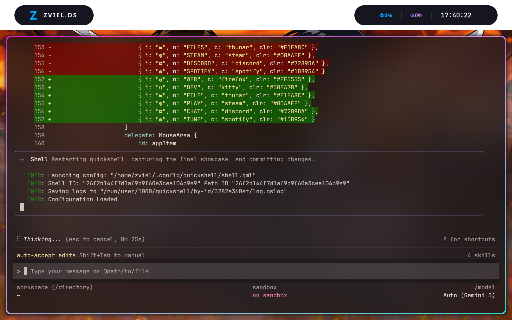

# ZVIEL.OS Quickshell Configuration

A modern, interactive desktop shell built with Quickshell and QML for Hyprland.

## Features
- **Swisher Sidebar**: Smooth, animated dashboard with staggered entry animations.
- **System Stats**: Real-time CPU and RAM monitoring.
- **Media Controller**: Integrated `playerctl` support for music and video playback.
- **App Launcher**: Quick access grid for core applications.
- **Minimalist Top Bar**: Pill-styled indicators for a clean aesthetic.

## Requirements
- `quickshell` (Arch Linux: `extra/quickshell`)
- `playerctl`
- `brightnessctl`
- `wireplumber` / `wpctl`
- `hyprland`

## Installation
1. Clone this repository to `~/.config/quickshell`.
2. Ensure environment variables are set (see `.quickshell_env`).
3. Run `quickshell`.

## Key Controls
- Click the **"Z" Logo** in the top bar to toggle the Swisher menu.
- **Sliders**: Adjust volume and brightness directly from the menu.
- **App Grid**: Launch common tools with hover-aware visual feedback.

## Showcase

